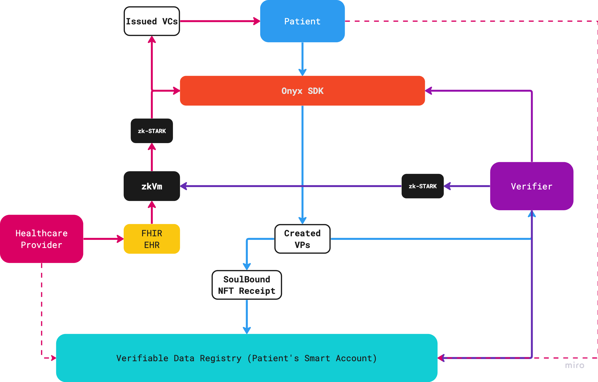

# Verifiable Credential ZK Health Record

VC ZK Health Record (VC-ZK HR) project was built during a [Digital Identity Hackathon](https://www.encode.club/digital-identity-hackathon) sponsored by [Onyx by J.P. Morgan](https://www.jpmorgan.com/onyx/index) and hosted by [Encode Club](https://www.encode.club/). This project showcases a real practical use of DIDs [(Decentralized IDs)](https://w3c-ccg.github.io/did-primer/), VCs [(Verifiable Credentials)](https://www.w3.org/TR/vc-data-model/), and ZKP [(Zero-Knowlegde Proofs)](https://zkhack.dev/whiteboard/) in the Healthcare Industry.

## Problems to Solve

- ***Interoperability*** - Electronic Health/Medical Records (EHR/EMR) are complex due to a high number of standards implemented in various areas within healthcare. Technology leaders like [Epic Systems](https://fhir.epic.com/), [SMART](https://docs.smarthealthit.org/), [CommonWell Health Alliance](https://specification.commonwellalliance.org/foundational-concepts/api-security), and [Apple's Health App](https://www.apple.com/healthcare/health-records/) are supporting the open standards [FHIR specifications by HL7](https://www.hl7.org/fhir/). This project demonstrates building with [FHIR](https://www.hl7.org/fhir/), [USDCI](https://www.healthit.gov/isa/united-states-core-data-interoperability-uscdi) data samples, and an open source healthcare developer platform called [Medplum](https://www.medplum.com/docs).
- ***Privacy/Sharing*** - Lack of interoperability increases possibilities for data breaches and mishandling patient records. Reverting back to paper records or keeping data private is not the answer in healthcare. Even the rise of AI has caused data to become a modern day gold rush causing companies to put up paywalls for data. [Zero-Knowledge](https://zkhack.dev/whiteboard/) protocols can provide an opportunity to share data like never before and move the needle towards precision medicine. This project demonstrates the use of [zk-STARK](https://starkware.co/stark/) and [RISC Zero's zkVM](https://dev.risczero.com/). 
- ***Ease-of-use*** - Life is short, a minute in healthcare can save a life. Without interoperability there will only be seclusion. [Account abstraction and EIP-4337](https://ethereum.org/en/roadmap/account-abstraction/) provides opportunity for an overall improved experience into Web3. This project demonstrates the use of [Biconomy's Smart Accounts Platform](https://docs.biconomy.io/docs/overview) based on [ERC-4337](https://eips.ethereum.org/EIPS/eip-4337) and [Magic's developer SDK](https://magic.link/docs/home/welcome) for Web3 onboarding.


## Demo


## User Flow Diagram



#### - [Healthcare Provider] 
- Sends FHIR EHR to zkEVM to generate a [Receipt](https://dev.risczero.com/zkvm/developer-guide/receipts)
    - Receipt contains a [journal](https://dev.risczero.com/terminology#journal) containing the public outputs of the zkVM application and a [seal, or the zk-STARK,](https://dev.risczero.com/terminology#seal) that attests the correct execution of the proven statement ***(aka [guest program](https://dev.risczero.com/terminology#guest-program))***.
    - An [ImageID](https://dev.risczero.com/terminology#image-id) is included in the public outputs for use in the a verification process.
- Onyx SDK executes [`create-and-sign-vc_with_schema_params.ts`](med_app/packages/onyx-ssi-sdk/src/issuer/create-and-sign-vc_with_schema_params.ts) to produce the verifiable credential (VC) issued by the Healthcare Provider. In details, the following occurs:
    - An arbitrary expiration data (1 year) is added to the VC.
    - Schema validation performed on the FHIR EHR using the [<code>fhir.schema.json</code>](med_app/packages/onyx-ssi-sdk/src/issuer/schemas/fhir.schema.json) file. Accuracy of the file is not verified and was obtained from this [Asymmetrik FHIR API Server](https://github.com/bluehalo/node-fhir-server-core/tree/master/packages/fhir-json-schema-validator) project.
    - Signed VC is written to file, [`medicationRequest_vc.json`](med_app/src/pages/verifiable-credentials/vc_store/medicationRequest_vc.json), simply simulating DB store at the issuer. 
- Sequence Ends, Patient has access to view the VC.

### - [Patient]
- Fulfils Identity Authorization to request for a VP. The Identity Authorization requires signing into a [Magic link](https://magic.link/docs/home/welcome).
- Onyx SDK executes [`create-and-sign-vp.ts`](med_app/packages/onyx-ssi-sdk/src/holder/create-and-sign-vp.ts) to produce the verifiable presentation (VP) issued by the patient.
- A SoulBound NFT Receipt is minted and sent to the Patient's Smart Account address: `0x59813E0B81C13d262054FD17c83460A7CE94Bbfc` on [Polygon's Mumbai Testnet](https://mumbai.polygonscan.com/address/0x59813e0b81c13d262054fd17c83460a7ce94bbfc#tokentxnsErc721). In details the following occurs:
    - f

### About the Dev

```
# Frontend Port:3000
cd med-app
npm install
npm run dev

# Onyx with API Port:3001
cd packages/onyx-ssi-sdk
npm run dev

# zkVM Port:8080
# Return to project root directory
cd zk_app
cargo run --release
```
