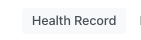
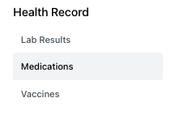
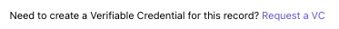
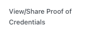
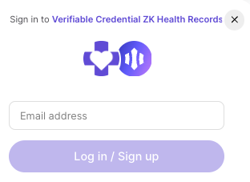
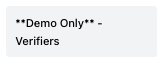
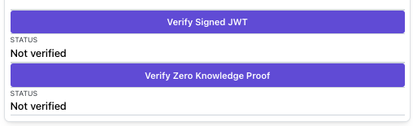
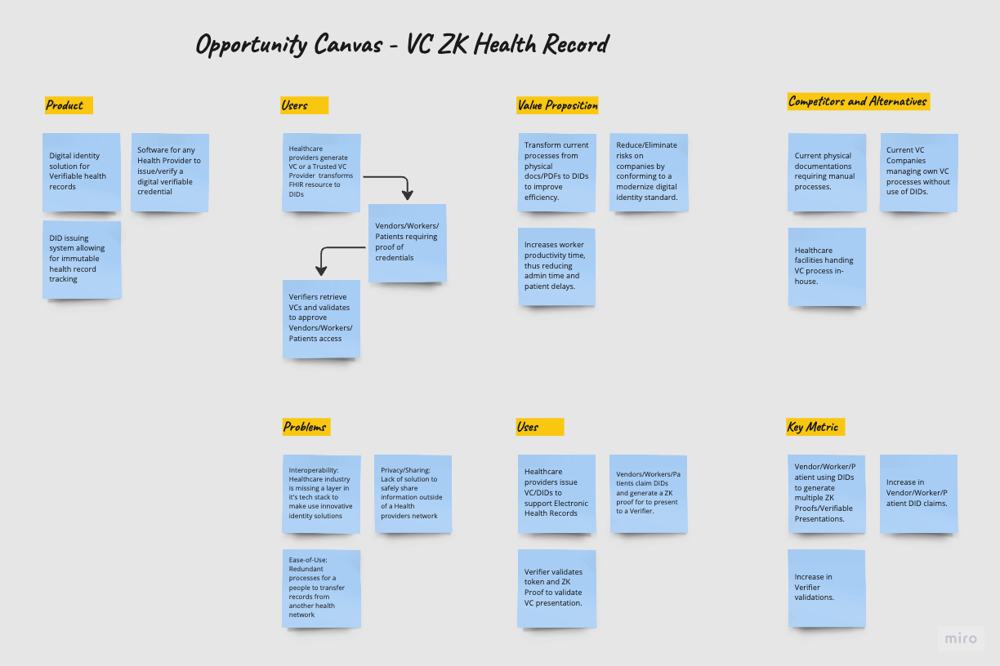
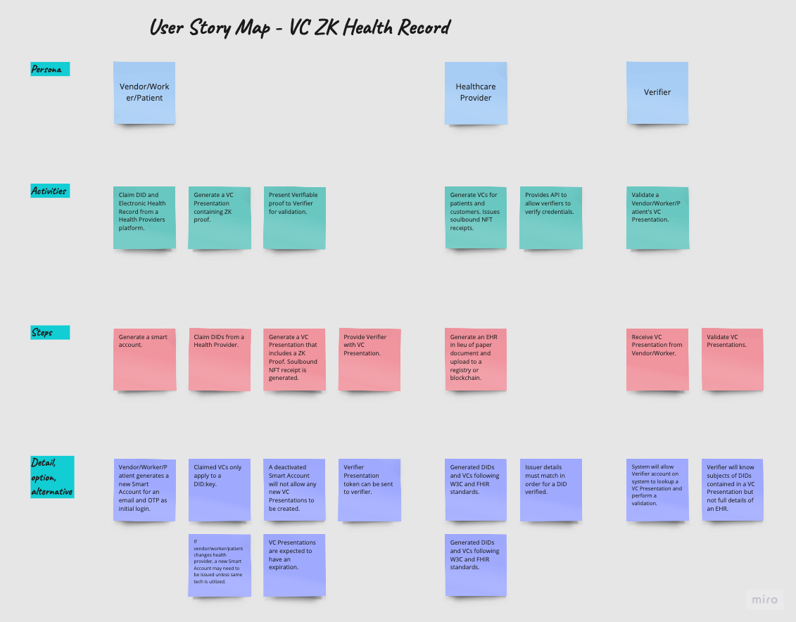

# Verifiable Credential ZK Health Records

VC ZK Health Records (VC-ZK HR) project was built during a [Digital Identity Hackathon](https://www.encode.club/digital-identity-hackathon) sponsored by [Onyx by J.P. Morgan](https://www.jpmorgan.com/onyx/index) and hosted by [Encode Club](https://www.encode.club/). This project showcases a real practical use of DIDs [(Decentralized IDs)](https://w3c-ccg.github.io/did-primer/), VCs [(Verifiable Credentials)](https://www.w3.org/TR/vc-data-model/), and ZKP [(Zero-Knowlegde Proofs)](https://zkhack.dev/whiteboard/) in the Healthcare Industry.

## Problems to Solve

- ***Interoperability*** - Electronic Health/Medical Records (EHR/EMR) are complex due to a high number of standards implemented in various areas within healthcare. Technology leaders like [Epic Systems](https://fhir.epic.com/), [SMART](https://docs.smarthealthit.org/), [CommonWell Health Alliance](https://specification.commonwellalliance.org/foundational-concepts/api-security), and [Apple's Health App](https://www.apple.com/healthcare/health-records/) are supporting the free and open standards of [FHIR specifications by HL7](https://www.hl7.org/fhir/). This project demonstrates building with [FHIR](https://www.hl7.org/fhir/), [USDCI](https://www.healthit.gov/isa/united-states-core-data-interoperability-uscdi) test sample data, and an open source healthcare developer platform called [Medplum](https://www.medplum.com/docs).
- ***Privacy/Sharing*** - Lack of interoperability increases possibilities for data breaches and mishandling patient records. Reverting back to paper records or keeping data private is not the answer in healthcare. Even the rise of AI has caused data to become a modern day gold rush causing companies to put up paywalls for data. [Zero-Knowledge](https://zkhack.dev/whiteboard/) protocols can provide an opportunity to share data like never before and move the needle towards precision medicine. This project demonstrates the use of [zk-STARK](https://starkware.co/stark/) and [RISC Zero's zkVM](https://dev.risczero.com/). 
- ***Ease-of-use*** - [Account abstraction and EIP-4337](https://ethereum.org/en/roadmap/account-abstraction/) provided the opportunity for an overall improved user experience into Web3. This project demonstrates the use of [Biconomy's Smart Accounts Platform](https://docs.biconomy.io/docs/overview) based on [ERC-4337](https://eips.ethereum.org/EIPS/eip-4337) and [Magic's developer SDK](https://magic.link/docs/home/welcome) for Web3 onboarding.


## Demo


## User Flow Diagram


### - [Healthcare Provider]
- Sends FHIR based electronic health record (EHR) to the zkEVM to generate a [Receipt](https://dev.risczero.com/zkvm/developer-guide/receipts). The full receipt is written to a file, [zkp_receipt.json](zk_app/zkp_receipt.json), in the [zk app](zk_app) to be used during the proof verification. Details of the verification will be found in the [Verifier section](#verifier-section).
    - A receipt contains a [journal](https://dev.risczero.com/terminology#journal) containing the public outputs of the zkVM application and a [seal, or the zk-STARK,](https://dev.risczero.com/terminology#seal) that attests the correct execution of the proven statement *(aka [guest program](https://dev.risczero.com/terminology#guest-program))*.
    - An [ImageID](https://dev.risczero.com/terminology#image-id) is included with the public outputs for use during the zk proof validation.
- [Onyx SDK API](med_app/packages/onyx-ssi-sdk) executes [`create-and-sign-vc_with_schema_params.ts`](med_app/packages/onyx-ssi-sdk/src/issuer/create-and-sign-vc_with_schema_params.ts) to produce the [verifiable credential (VC)](https://www.w3.org/2018/credentials/) issued by the Healthcare Provider. In details, the following occurs:
    - An arbitrary expiration data *(1 year)* is added to the VC.
    - Schema validation performed on the FHIR EHR using the [<code>fhir.schema.json</code>](med_app/packages/onyx-ssi-sdk/src/issuer/schemas/fhir.schema.json) file. Accuracy of the file is not verified and was obtained from this [Asymmetrik FHIR API Server](https://github.com/bluehalo/node-fhir-server-core/tree/master/packages/fhir-json-schema-validator) project.
    - Signed VC is written to file, [`medicationRequest_vc.json`](med_app/src/pages/verifiable-credentials/vc_store/medicationRequest_vc.json), simply simulating DB store at the issuer. 
- Sequence Ends, Patient has access to view the VC.

### - [Patient]
- Fulfils Identity Authorization to request for a [verifiable presentation (VP)](https://w3c-ccg.github.io/vp-request-spec/). The Identity Authorization requires signing into a [Magic link](https://magic.link/docs/home/welcome).
- [Onyx SDK API](med_app/packages/onyx-ssi-sdk) executes [`create-and-sign-vp.ts`](med_app/packages/onyx-ssi-sdk/src/holder/create-and-sign-vp.ts) to produce the verifiable presentation (VP) issued by the patient.
 - Signed VP is written to file, [`medicationRequest_vp.json`](med_app/src/pages/verifiable-credentials/vc_store/medicationRequest_vp.json), simply simulating DB store at the issuer. 
- [SoulBound NFT Receipt token](https://testnets.opensea.io/collection/healthrecordnftreceipt) is minted and sent to the Patient's Smart Account address: `0xae2Dd7f355bE651A71E72B780cdEf3D38a7EDAf6` on [Polygon's Mumbai Testnet](https://mumbai.polygonscan.com/address/0xae2dd7f355be651a71e72b780cdef3d38a7edaf6#tokentxnsErc721). In detail, the following occurs:
    - The `DID:Key` representing the Issuers signed VC is added to a metadata object and uploaded to [IPFS](https://docs.ipfs.tech/) via [Pinata](https://docs.pinata.cloud/docs) to obtain a [CID](https://docs.pinata.cloud/docs/cids) for use during the minting of the NFT Receipt token.
    - [Biconomy's Sponsored Paymaster Service](https://docs.biconomy.io/docs/Biconomy%20AA%20Stack/Paymaster/description) creates a gasless experience for the patient. Signing onto [Magic link](https://magic.link/docs/home/welcome) is a requirement in order for the process to run.
    - The [VC SoulBound Receipt Contract](registry/src/VCSoulBoundReceipt.sol) address: `0x50F49A3B09BD7597ff588686843d9b03070EdCbe` was previously setup and deployed on the [testnet](https://mumbai.polygonscan.com/address/0x50F49A3B09BD7597ff588686843d9b03070EdCbe). The patient's smart account address was also granted a MINTER_ROLE for the project demo. [Remix](https://remix.ethereum.org/) was utilized to setup the NFT contract for the project's demo. No UI has been created for granting/revoking of roles or NFT token burn at the completion of this hackathon project.
- Sequence Ends, Patient has access to the signed VP and able to share with a verifier.


### - <a name="verifier-section"></a> [Verifier]
- The application displays a Verifier section to simulate the verification procedures. Running the `Verify Signed JWT` is needed before running the `Verify Zero Knowledge Proof` in the application to reveal the payload of a decoded VP, resulting with the signed VC.
- [Onyx SDK API](med_app/packages/onyx-ssi-sdk) executes [`verify.ts`](med_app/packages/onyx-ssi-sdk/src/verifier/verify.ts) confirming a valid signed VP/VC JWT token.
- During the zk proof verification, the payload of the signed VC token is decoded to retain the [ImageID](https://dev.risczero.com/terminology#image-id). The ImageID is sent to the [zkVM API](zk_app/api/src/main.rs) to execute the `receipt.verify(ImageID)` method for proof verification. The receipt itself is read from the file, [zkp_receipt.json](zk_app/zkp_receipt.json), simulating a possible zk receipt registry. In this project, the file will only contain the last generated zk proof.
- In this project, I applied a reversed approach to the zk proof verification process compared to the method described by [RISC zero](https://dev.risczero.com/zkvm/developer-guide/receipts). The method described in the link would have the prover send the [full receipt](zk_app/zkp_receipt.json) to the verifier.
    - This zkVM app instead returns only the [ImageID](https://dev.risczero.com/terminology#image-id) and the [journal](https://dev.risczero.com/terminology#journal) portion of the receipt.
    - RISC zero has a zk proof as a service type of feature in development called [Bonsai](https://dev.risczero.com/bonsai/) potentially to serve as a more viable use in the healthcare industry versus running separate zkVMs. This project is simulating this type of user experience.
- Additionally, a verifier can manually verify the patient's smart account for the NFT Receipt to match the `DID:Key` related to a verifiable credential. 
- Sequence Ends, zk proof verified.

---
## Components

### [Frontend](med_app/src)
- A free and open-source sample [healthcare webapp by the Medplum Team](https://github.com/medplum/foomedical) was used for this project to bootstrap the secure and compliant backend as well as learning and applying the [FHIR](https://www.hl7.org/fhir/) standards to create a more realistic Healthcare project. 
- The following UI components are the focus of this project:
    - [`medication.tsx`](med_app/src/pages/health-record/Medication.tsx) - Process from FHIR resource data > zkVM > signed VC
    - [`VcItem.tsx`](med_app/src/pages/verifiable-credentials/VcItem.tsx) - Patient signing of Verifiable Credentials
    - [`VpItem.tsx`](med_app/src/pages/verifiable-credentials/VpItem.tsx) - Patient issuing of Verifiable Presentations
    - [`VerifyItem.tsx`](med_app/src/pages/verifiable-credentials/VerifyItem.tsx) - Verifier validations

### [Onyx SDK API](med_app/packages/onyx-ssi-sdk)
- The following components were added or modified from Onyx's original SDK to meet the needs to the project
    - [`create-and-sign-vc_with_schema_params.ts`](med_app/packages/onyx-ssi-sdk/src/issuer/create-and-sign-vc_with_schema_params.ts) - Health Provider
    - [`create-and-sign-vp.ts`](med_app/packages/onyx-ssi-sdk/src/holder/create-and-sign-vp.ts) - Patient
    - [`verify.ts`](med_app/packages/onyx-ssi-sdk/src/verifier/verify.ts) - Verifier
    - [`app.ts`](med_app/packages/onyx-ssi-sdk/src/api/app.ts) - API server to access SDK from Frontend
    - [`uploadMetadata.ts`](med_app/packages/onyx-ssi-sdk/src/api/uploadMetadata.ts) - NFT metadata processing

### [SoulBound NFT Contract](registry)
- Created smart contract code using [Foundry](https://book.getfoundry.sh/)
    - [`VCSoulBoundReceipt.sol`](registry/src/VCSoulBoundReceipt.sol)
    - [`VCSoulBoundReceipt_flatten.sol`](registry/src/flatten/VCSoulBoundReceipt_flatten.sol) - For verifying contract on testnet

### [zkVM API](zk_app)
- Created with [Rust](https://www.rust-lang.org/)
    - [`main.rs`](zk_app/api/src/main.rs) - API server with [Actix](https://actix.rs/)
    - [`lib.rs`](zk_app/host/src/lib.rs) - Host code using [RISC zero zkVM](https://dev.risczero.com/zkvm/developer-guide/host-code-101)
    - [`main.rs`](zk_app/methods/guest/src/main.rs) - Guest code using [RISC zero zkVM](https://dev.risczero.com/zkvm/developer-guide/guest-code-101)

---
## Demo Walkthrough

[Patient] </br>
1. Click `Log in` button on the top-right of screen: 
</br>
2. Login with the sample profile to ensure sample data are loaded: username: **`salvador.web3.patient@gmail.com`** and password: **`encode_onyx`** 
3. Click on `Health Record`
</br>
4. Click `Medications` on left sidebar
</br>
5. Click on one of the 2 sample Medication Request records
6. Click the `Request VC` link to generate a signed verifiable credential with zk proof
</br>
7. A modal will appear, click `Submit VC Request`
</br>
8. After issued VC is created, a link will appear. Click on link to navigate to the VC section and view the available VCs
</br>
9. Click on an available VC to view the details page
10. A chevron icon is available to display the VC token string. Copy and paste into the `Encoded` section of this [JWT site](https://jwt.io/) to decode and view the payload
11. Click button to sign the issued VC and create a VP
</br>
12. Click `View/Share Proof of Credentials` in the sidebar section
</br>
12. Clink on an available VP
13. A chevron icon is available to display the VP token string. Copy and paste into the `Encoded` section of this [JWT site](https://jwt.io/) to decode and view the payload
14. Click button to login via Magic link
</br>
15. Login with an email. 
</br>
16. Click on submit button to generate a NFT Receipt and send to your smart account.
</br>***In order to get beyond this point, you need to Sign-up for your own account on Medplum and load in the [sample data](https://www.medplum.com/docs/tutorials/importing-sample-data) from the [Medplum tutorials](https://www.medplum.com/docs/tutorials). In the Medplum.app, locate a medication request record and view the raw JSON. Copy and create a new medication request record and apply the Patient ID that is assigned to your Medplum account. Then deploy your own NFT SoulBound contract, verify it on Polygon's testnet, setup a Biconomy Paymaster and create a policy allowing a safe mint user op on the NFT contract, and grant the necessary MINTER_ROLE to the Smart Account that gets generated during the Biconomy/Magic login. Feel free to reach out to me if you have questions.***
17. After NFT mint is complete, a link will display.
</br>
18. Clink link to see on [OpenSea Testnets](https://testnets.opensea.io/assets/mumbai/0xa543cf2937b0b00b62f325b3b778517be3d7cebc/2282856)
19. Clink on the TokenID in the Details section to view the [metadata](https://ipfs.io/ipfs/QmQXqk5wKN4MiyzqBUJTXA8ZcH1hXakDfcRe9fjWAfH69a) from IPFS.

</br>

[Verifier]

1. Click on `**Demo Only** - Verifiers` in the sidebar of the `Verifiable Credentials` section
</br>
2. Click on each `Verify` button to perform describe verification. Chevron icons are available to view the JWT strings
</br>

---
## Setting up project
### Required package mangers and version used in this project:
- [Node](https://nodejs.org/en) v18.17.1
- [Cargo](https://doc.rust-lang.org/cargo/getting-started/index.html) 1.72.1

### Instructions:

#### The NFT Receipt portion of the app can be ignored if you don't want to setup the Web3 related items in the env file. Otherwise the following will be needed:
- Deploy [SoulBound NFT contract](registry/src/VCSoulBoundReceipt.sol), grant MINTER_ROLES to Biconomy Smart Account address, and Verify contract on [Polygon Mumbai Testnet](https://mumbai.polygonscan.com/)
- Setup [Biconomy Paymaster](https://docs.biconomy.io/docs/dashboard/paymaster), Deposit Mumbai testnet [Matic tokens](https://faucet.polygon.technology/) in Gas-Tank, add NFT contract to the policy allowing the `safeMint` method.
- Setup a [Magic](https://magic.link/) account

#### Setup env files, remove `.example` from filename:
- For Frontend: [env](med_app/.env.example)
- For Onyx SDK: [env](med_app/packages/onyx-ssi-sdk/.env.example)
    - Run script to create keys for env file:
        - `cd ./med_app/packages/onyx-ssi-sdk`
        - `npm run create:keypair`

#### Install Dependencies for Node packages and Rust crates

- Frontend - runs on port:3000
- Onyx API - runs on port:3001
- zkVM API - runs on port:8080

```
cd med-app
npm install
npm run dev

cd packages/onyx-ssi-sdk
npm run dev


// Return to project root directory
cd zk_app
cargo run --release
```

Open in browser, [localhost:3000](http://localhost:3000), enjoy!

---
### MISC: From Design Thinking Onyx Hackathon Workshop




---
### [About the Dev](https://linktr.ee/chrissalvador)
---