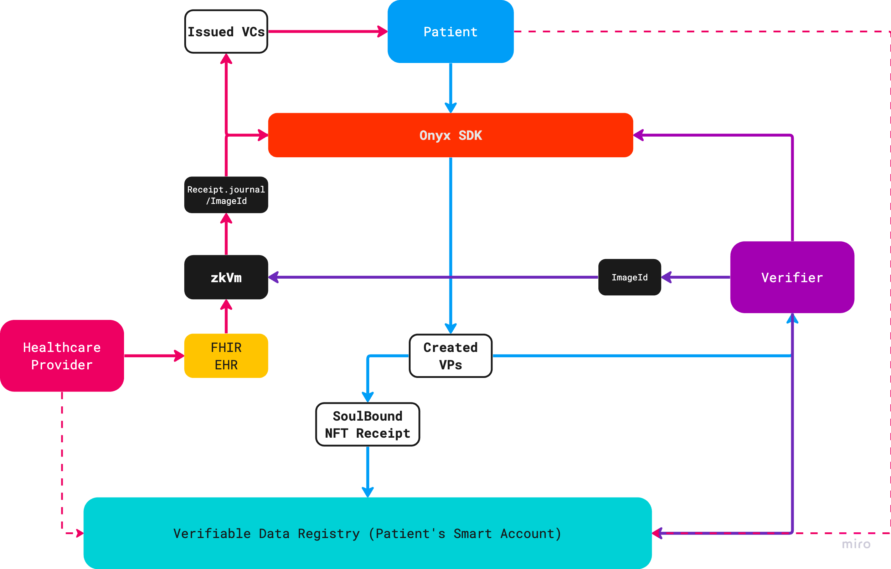

# Verifiable Credential ZK Health Records

VC ZK Health Records (VC-ZK HR) project was built during a [Digital Identity Hackathon](https://www.encode.club/digital-identity-hackathon) sponsored by [Onyx by J.P. Morgan](https://www.jpmorgan.com/onyx/index) and hosted by [Encode Club](https://www.encode.club/). This project showcases a real practical use of DIDs [(Decentralized IDs)](https://w3c-ccg.github.io/did-primer/), VCs [(Verifiable Credentials)](https://www.w3.org/TR/vc-data-model/), and ZKP [(Zero-Knowlegde Proofs)](https://zkhack.dev/whiteboard/) in the Healthcare Industry.

## Problems to Solve

- ***Interoperability*** - Electronic Health/Medical Records (EHR/EMR) are complex due to a high number of standards implemented in various areas within healthcare. Technology leaders like [Epic Systems](https://fhir.epic.com/), [SMART](https://docs.smarthealthit.org/), [CommonWell Health Alliance](https://specification.commonwellalliance.org/foundational-concepts/api-security), and [Apple's Health App](https://www.apple.com/healthcare/health-records/) are supporting the open standards [FHIR specifications by HL7](https://www.hl7.org/fhir/). This project demonstrates building with [FHIR](https://www.hl7.org/fhir/), [USDCI](https://www.healthit.gov/isa/united-states-core-data-interoperability-uscdi) data samples, and an open source healthcare developer platform called [Medplum](https://www.medplum.com/docs).
- ***Privacy/Sharing*** - Lack of interoperability increases possibilities for data breaches and mishandling patient records. Reverting back to paper records or keeping data private is not the answer in healthcare. Even the rise of AI has caused data to become a modern day gold rush causing companies to put up paywalls for data. [Zero-Knowledge](https://zkhack.dev/whiteboard/) protocols can provide an opportunity to share data like never before and move the needle towards precision medicine. This project demonstrates the use of [zk-STARK](https://starkware.co/stark/) and [RISC Zero's zkVM](https://dev.risczero.com/). 
- ***Ease-of-use*** - [Account abstraction and EIP-4337](https://ethereum.org/en/roadmap/account-abstraction/) provides opportunity for an overall improved experience into Web3. This project demonstrates the use of [Biconomy's Smart Accounts Platform](https://docs.biconomy.io/docs/overview) based on [ERC-4337](https://eips.ethereum.org/EIPS/eip-4337) and [Magic's developer SDK](https://magic.link/docs/home/welcome) for Web3 onboarding.


## Demo


## User Flow Diagram



### - [Healthcare Provider]
- Sends FHIR EHR to zkEVM to generate a [Receipt](https://dev.risczero.com/zkvm/developer-guide/receipts). The full receipt is written to a file, [zkp_receipt.json](zk_app/zkp_receipt.json), in the [zk app](zk_app) to be used during the proof verification. Details of the verification will be found in the [Verifier section](#verifier-section).
    - Receipt contains a [journal](https://dev.risczero.com/terminology#journal) containing the public outputs of the zkVM application and a [seal, or the zk-STARK,](https://dev.risczero.com/terminology#seal) that attests the correct execution of the proven statement ***(aka [guest program](https://dev.risczero.com/terminology#guest-program))***.
    - An [ImageID](https://dev.risczero.com/terminology#image-id) is included with the public outputs for use during the zk proof validation.
- Onyx SDK executes [`create-and-sign-vc_with_schema_params.ts`](med_app/packages/onyx-ssi-sdk/src/issuer/create-and-sign-vc_with_schema_params.ts) to produce the verifiable credential (VC) issued by the Healthcare Provider. In details, the following occurs:
    - An arbitrary expiration data (1 year) is added to the VC.
    - Schema validation performed on the FHIR EHR using the [<code>fhir.schema.json</code>](med_app/packages/onyx-ssi-sdk/src/issuer/schemas/fhir.schema.json) file. Accuracy of the file is not verified and was obtained from this [Asymmetrik FHIR API Server](https://github.com/bluehalo/node-fhir-server-core/tree/master/packages/fhir-json-schema-validator) project.
    - Signed VC is written to file, [`medicationRequest_vc.json`](med_app/src/pages/verifiable-credentials/vc_store/medicationRequest_vc.json), simply simulating DB store at the issuer. 
- Sequence Ends, Patient has access to view the VC.

### - [Patient]
- Fulfils Identity Authorization to request for a VP. The Identity Authorization requires signing into a [Magic link](https://magic.link/docs/home/welcome).
- Onyx SDK executes [`create-and-sign-vp.ts`](med_app/packages/onyx-ssi-sdk/src/holder/create-and-sign-vp.ts) to produce the verifiable presentation (VP) issued by the patient.
 - Signed VP is written to file, [`medicationRequest_vp.json`](med_app/src/pages/verifiable-credentials/vc_store/medicationRequest_vp.json), simply simulating DB store at the issuer. 
- A [SoulBound NFT Receipt token](https://testnets.opensea.io/collection/soulboundrecord-1) is minted and sent to the Patient's Smart Account address: `0x59813E0B81C13d262054FD17c83460A7CE94Bbfc` on [Polygon's Mumbai Testnet](https://mumbai.polygonscan.com/address/0x59813e0b81c13d262054fd17c83460a7ce94bbfc#tokentxnsErc721). In detail, the following occurs:
    - The `DID:Key` representing the Issuers signed VC is added to a metadata object and uploaded to [IPFS](https://docs.ipfs.tech/) via [Pinata](https://docs.pinata.cloud/docs) to obtain a [CID](https://docs.pinata.cloud/docs/cids) for use during the minting of the NFT Receipt token.
    - [Biconomy's Sponsored Paymaster Service](https://docs.biconomy.io/docs/Biconomy%20AA%20Stack/Paymaster/description) creates a gasless experience for the patient. The patient's Magic link sign-in is a requirement in order for the process to run.
    - The [SoulBound NFT Contract](registry/src/SoulBoundRecord.sol) address: `0xa543cf2937b0b00b62f325b3b778517be3d7cebc` was previously setup and deployed on the [testnet](https://mumbai.polygonscan.com/address/0xa543cf2937b0b00b62f325b3b778517be3d7cebc). The patient's smart account address was also granted a MINTER_ROLE for the project demo. [Remix](https://remix.ethereum.org/) was utilized to setup the NFT contract for the project's demo. No UI has been created for granting/revoking of roles or NFT token burn at the completion of this hackathon project.
- Sequence Ends, Patient has access to the signed VP and able to share with a verifier.


### - <a name="verifier-section"></a> [Verifier]
- The application displays a Verifier section to simulate the verification procedures. Running the `Verify Signed JWT` is needed before running the `Verify Zero Knowledge Proof` in the application to reveal the payload of a decoded VP, resulting with the signed VC.
- Onyx SDK executes [`verify.ts`](med_app/packages/onyx-ssi-sdk/src/verifier/verify.ts) confirming a valid signed VP/VC JWT token.
- During the zk proof verification, the payload of the signed VC token is decoded to retain the [ImageID](https://dev.risczero.com/terminology#image-id). The ImageID is sent to the [zkVM API](zk_app/api/src/main.rs) to execute the `receipt.verify(ImageID)` method for proof verification. The receipt itself is read from the file, [zkp_receipt.json](zk_app/zkp_receipt.json), simulating a possible zk receipt registry. In this project, the file will only contain the last generated zk proof.
- In this project, I applied a reversed approach to the zk proof verification process compared to the method described by [RISC zero](https://dev.risczero.com/zkvm/developer-guide/receipts). The method described in the link would have the prover send the [full receipt](zk_app/zkp_receipt.json) to the verifier.
    - This zkVM app instead returns only the [ImageID](https://dev.risczero.com/terminology#image-id) and the [journal](https://dev.risczero.com/terminology#journal) portion of the receipt.
    - RISC zero has a zk proof as a service type of feature in development called [Bonsai](https://dev.risczero.com/bonsai/) potentially to serve as a more viable use in the healthcare industry versus running separate zkVMs. This project is simulating this type of user experience.
- Additionally, a verifier can manually verify the patient's smart account for the NFT Receipt to match the `DID:Key` related to a verifiable credential. 
- Sequence Ends, zk proof verified.


### About the Dev

```
# Frontend Port:3000
cd med-app
npm install
npm run dev

# Onyx with API Port:3001
cd packages/onyx-ssi-sdk
npm run dev

# zkVM Port:8080
# Return to project root directory
cd zk_app
cargo run --release
```
